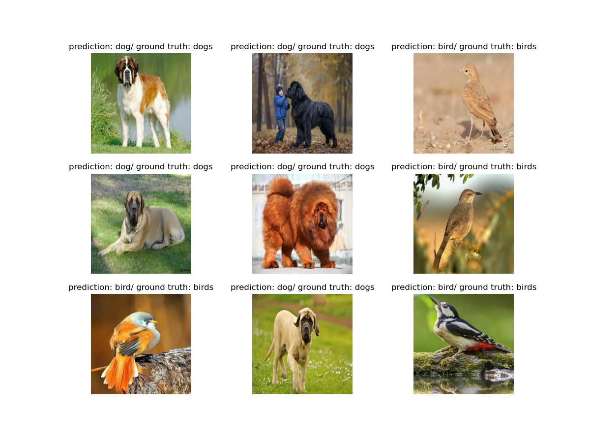

# miniCLIP
This repo is a small version of CLIP model. Here we used ResNet50 and DistilledBERT as vision and text encoder. As dataset [Flickr30k](https://huggingface.co/datasets/nlphuji/flickr30k) was used. Also we checked model capabilities on a [this](https://universe.roboflow.com/qqq-ujrb9/dataset-wmw7n/dataset/1) dataset
## Installation 

```shell
conda env create -f environment.yml
conda activate clip-env
```

## Reproducing results

### Training scripts

To train  model on flickr30k dataset firts [download](https://drive.google.com/file/d/1sAWr9AHS8N8qf5hOvTyP5sxD7HN6QLeW/view?usp=drive_link) and extract to ```data/```

```shell
cd src
python train_eval.py
```
### Zero-shot classification

To make a zero-shot you will need to download [checkpoint](https://drive.google.com/file/d/1NUQKabiV16Y3w5iBmNwVjIZS9RrjPelV/view?usp=sharing) and put into ```ckpt/``` and [zero-shot data](https://drive.google.com/file/d/1GkBgcVtzTnZkCTV7KBSbSyi5HBl9Ijh8/view?usp=sharing) to ```zero shot/```

```shell
cd src/
python zero_shot.py
```

